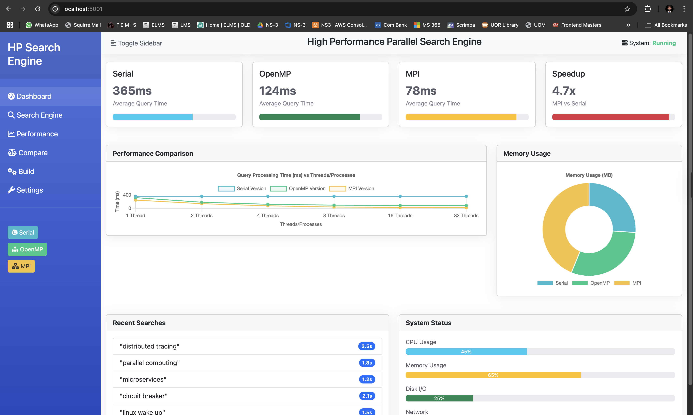
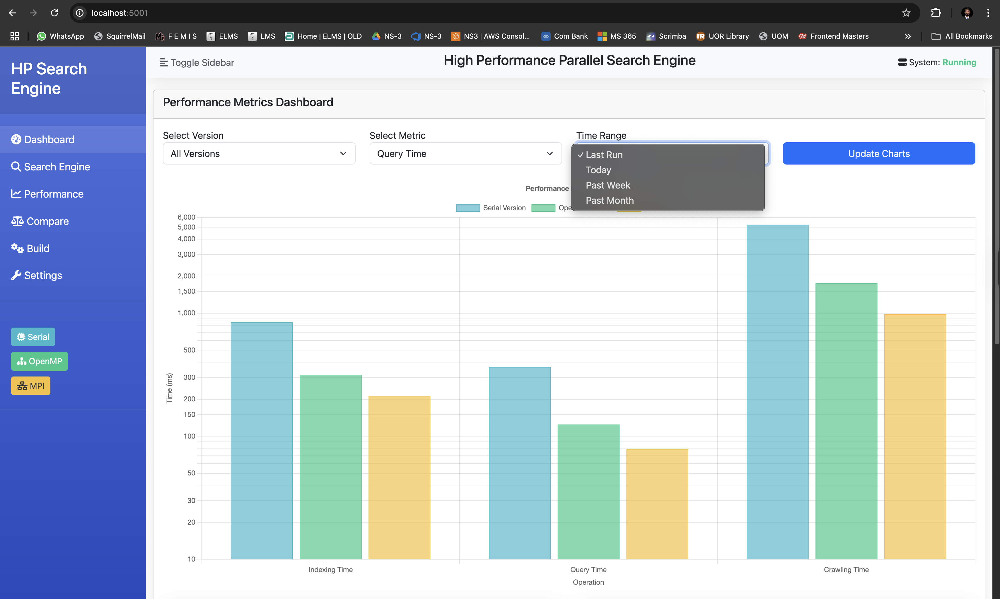
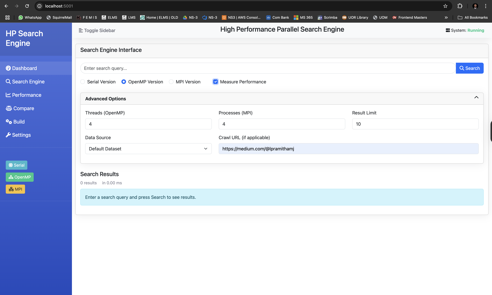
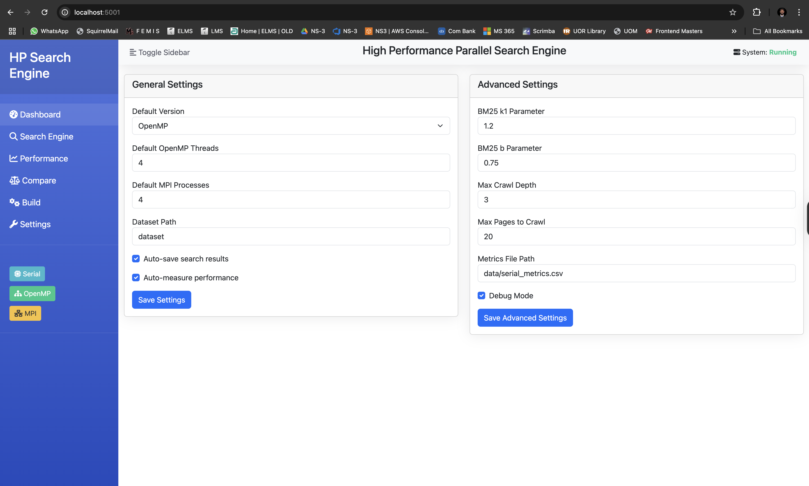
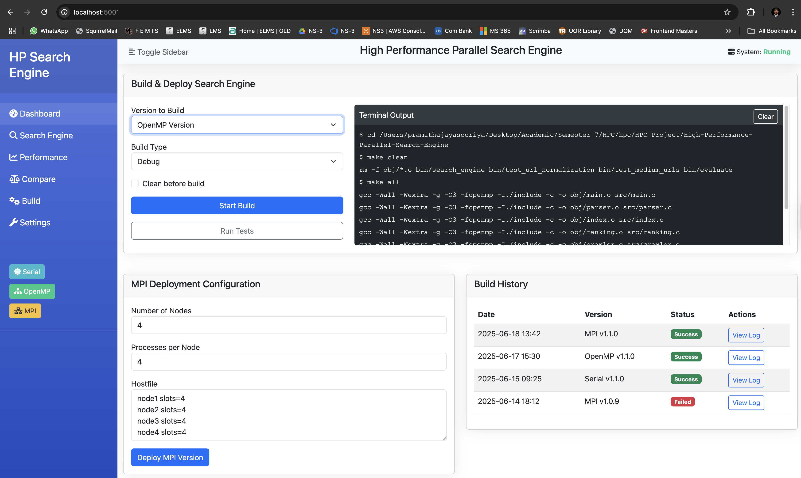
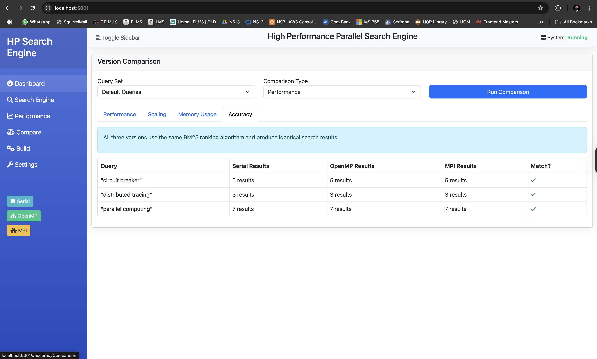

## Core Components

### 1. Main (main.c)

- The entry point that handles command-line arguments and coordinates program flow
- Supports multiple operation modes:
  - `-u URL`: Download and index content from a single URL
  - `-c URL`: Crawl website starting from URL (follows links)
  - `-m USER`: Crawl Medium profile for a specific user
  - `-d NUM`: Maximum crawl depth (default: 2)
  - `-p NUM`: Maximum pages to crawl (default: 10)
- Once content is downloaded/crawled, it builds an index and accepts search queries

### 2. Crawler (crawler.c)

- Handles website crawling and content extraction using libcurl
- Uses breadth-first search to navigate web pages up to a specified depth
- Key functionalities:
  - `crawl_website()`: Main crawling function that manages the BFS queue
  - `download_url()`: Downloads content from a URL
  - `normalize_url()`: Cleans URLs to avoid duplicates
  - `extract_links()`: Parses HTML to find linked pages
  - HTML content extraction with special handling for Medium.com articles

### 3. Parser (parser.c)

- Processes downloaded documents and prepares them for indexing
- Functions include:
  - `parse_file()`: Reads file content and initiates tokenization
  - `tokenize()`: Splits text into individual words/tokens
  - `to_lowercase()`: Converts tokens to lowercase for case-insensitive search
  - Removes stopwords using the `is_stopword()` function
  - Performs stemming with the `stem()` function to normalize word variations

### 4. Index (index.c)

- Manages the inverted index data structure
- Key components:
  - `InvertedIndex` struct: Stores terms and their document postings
  - `Document` struct: Stores document information
  - `build_index()`: Processes all files in the dataset directory
  - `add_token()`: Adds a token to the inverted index
  - `get_doc_length()`, `get_doc_count()`, `get_doc_filename()`: Utility functions

### 5. Ranking (ranking.c)

- Implements the BM25 algorithm for relevance-based ranking
- Key components:
  - `rank_bm25()`: Performs query processing using BM25 formula
  - BM25 parameters (k1=1.5, b=0.75) for term frequency normalization
  - Uses an inverted index to efficiently find matching documents

### 6. Metrics (metrics.c)

- Collects and reports performance metrics:
  - Execution time (crawling, parsing, tokenizing, indexing, etc.)
  - Memory usage
  - Document statistics
  - Query latency
- Provides functions to save metrics to CSV files for benchmarking

### 7. Benchmark & Evaluation (benchmark.c, evaluate.c)

- evaluate.c: Tests search quality with sample queries
- benchmark.c: Tools for performance measurement and comparison

## Data Flow & Processing Logic

1. **Web Crawling Process**:

   - Starts with a seed URL and performs breadth-first traversal
   - For each URL:
     - Checks if already visited using `has_visited()`
     - Downloads content with libcurl
     - Extracts clean text from HTML
     - Extracts links for further crawling
     - Saves content to the dataset directory with meaningful filenames
2. **Indexing Process**:

   - Reads all files in the dataset directory
   - For each file:
     - Parses content into tokens
     - Removes stopwords
     - Applies stemming
     - Adds tokens to inverted index with document frequencies
3. **Search Process**:

   - Tokenizes the search query
   - Removes stopwords and applies stemming
   - For each token:
     - Finds matching documents in the inverted index
     - Calculates BM25 scores based on term frequency and document length
   - Sorts documents by their accumulated scores
   - Returns the top-k results
4. **BM25 Ranking**:

   - Score = IDF × ((tf × (k1 + 1)) / (tf + k1 × (1 - b + b × dl / avgdl)))
   - Where:
     - IDF: Inverse document frequency
     - tf: Term frequency in document
     - dl: Document length
     - avgdl: Average document length
     - k1=1.5, b=0.75: Tuning parameters

## Special Features

1. **Medium.com Optimization**:

   - Custom URL handling for Medium profiles
   - Better article extraction with special handling for Medium markup
   - Rate-limiting between requests to prevent being blocked
2. **URL Normalization**:

   - Removes tracking parameters (utm_, fbclid, etc.)
   - Handles relative URLs properly
   - Prevents duplicate crawling of the same content
3. **HTML Content Extraction**:

   - Removes HTML tags, scripts, styles
   - Preserves meaningful headings and paragraphs
   - Converts HTML entities to proper characters
   - Outputs in a clean text format suitable for searching

## Performance Considerations

The serial implementation has several performance bottlenecks:

1. Sequential web crawling - can't download pages in parallel
2. Sequential document parsing and indexing
3. No parallel query processing
4. In-memory index with size limitations

## Parallelized Components

### 1. Index Building (index.c)

```c
// Building the index from multiple files
#pragma omp parallel for schedule(dynamic) reduction(+ : successful_docs)
for (int i = 0; i < file_count; i++) {
    int thread_id = omp_get_thread_num();
    printf("Thread %d processing file: %s\n", thread_id, file_paths[i]);
  
    if (parse_file_parallel(file_paths[i], i)) {
        // Document processing code...
        successful_docs++;
    }
}
```

**Why parallelized:**

- File processing is an embarrassingly parallel task - each file can be processed independently
- Document parsing is I/O and CPU intensive
- No dependencies between documents during initial parsing

**Critical sections:**

```c
#pragma omp critical(doc_metadata)
{
    strncpy(documents[i].filename, filename, MAX_FILENAME_LEN - 1);
    documents[i].filename[MAX_FILENAME_LEN - 1] = '\0';
}
```

- This section protects the shared `documents` array from race conditions when multiple threads update it concurrently

### 2. Term Indexing and Document Length Updates

```c
// Adding a token to the index (called during parsing)
void add_token(const char *token, int doc_id) {
    // Start timing
    start_timer();
  
    // Protect the shared index structure
    omp_set_lock(&index_lock);
  
    // Index update logic...
  
    omp_unset_lock(&index_lock);
  
    // Update document length
    omp_set_lock(&doc_length_lock);
    doc_lengths[doc_id]++;
    omp_unset_lock(&doc_length_lock);
  
    // Record tokenizing time
    metrics.tokenizing_time += stop_timer();
}
```

**Why parallelized:**

- Uses OpenMP locks instead of critical sections for finer-grained control
- Two separate locks for different shared resources (index and document lengths)

**Critical points:**

- The inverted index structure is a shared resource - requires synchronization
- Document length tracking needs protection from concurrent updates

### 3. Web Crawling (crawler.c)

```c
// URL extraction and processing
#pragma omp parallel num_threads(num_threads)
{
    int thread_id = omp_get_thread_num();
    thread_active[thread_id] = 1;
  
    #pragma omp for schedule(dynamic)
    for (int i = 0; i < html_size; i += chunk_size) {
        // Process chunks of HTML to extract links
    }
}
```

**Why parallelized:**

- HTML parsing is computationally expensive
- Extracting links from different sections of HTML can be done in parallel
- Link extraction doesn't modify the original HTML content

**Critical sections:**

```c
#pragma omp critical(queue_access)
{
    int queue_size = (rear - front + MAX_URLS) % MAX_URLS;
    // Queue operations...
}
```

- URL queue management needs protection to prevent corruption of the queue data structure

### 4. BM25 Ranking (ranking.c)

```c
// Score calculation for search results
#pragma omp parallel
{
    #pragma omp for
    for (int j = 0; j < df; ++j) {
        int d = index_data[i].postings[j].doc_id;
        int tf = index_data[i].postings[j].freq;
        double dl = get_doc_length(d);
        double score = idf * ((tf * (1.5 + 1)) / (tf + 1.5 * (1 - 0.75 + 0.75 * dl / avg_dl)));

        #pragma omp critical
        {
            results[d].doc_id = d;
            results[d].score += score;
            if (d + 1 > result_count)
                result_count = d + 1;
        }
    }
}
```

**Why parallelized:**

- BM25 score calculation for each document is independent
- Query processing is often a bottleneck in search engines
- Score calculations involve floating-point operations that benefit from parallel execution

**Critical section:**

- Score accumulation in the results array needs protection to prevent race conditions

### 5. Term Search (index.c)

```c
// Parallel search for terms in the index
int parallel_search_term(const char *term, Posting **results, int *result_count) {
    // Initialize results...
    int found = -1;

    #pragma omp parallel for
    for (int i = 0; i < index_size; i++) {
        if (strcmp(index_data[i].term, term) == 0) {
            #pragma omp critical(search_result)
            {
                if (found == -1) { // Only set if not already found
                    found = i;
                }
            }
        }
    }
  
    // Process results...
}
```

**Why parallelized:**

- Term matching across a large index is computationally expensive
- First-match semantics are preserved with the critical section
- Multiple threads can search different parts of the index simultaneously

**Critical point:**

- Updating the `found` variable needs synchronization to ensure only the first match is recorded

### 6. Index Clearing and Initialization

```c
// Clear the index for rebuilding
void clear_index() {
    #pragma omp parallel sections
    {
        #pragma omp section
        {
            // Reset index data
            index_size = 0;
        }

        #pragma omp section
        {
            // Reset document lengths
            memset(doc_lengths, 0, sizeof(doc_lengths));
        }

        #pragma omp section
        {
            // Reset documents array
            memset(documents, 0, sizeof(documents));
        }
    }
}
```

**Why parallelized:**

- Different memory areas can be initialized independently
- Memory operations benefit from parallel execution
- Parallel sections allow different threads to handle different initialization tasks

## Non-Parallelized Components and Rationale

### 1. Index Structure Management

The core index structure manipulation is protected by locks but not fully parallelized because:

- The inverted index has complex dependencies between terms
- The structure has inherent sequential nature for insertion and lookup
- It's more efficient to use fine-grained locks than to attempt full parallelization

### 2. Parser Initialization

```c
int parse_file(const char *filepath, int doc_id) {
    // File opening and memory allocation
    // ...
}
```

This function is not parallelized internally because:

- File operations are primarily I/O bound
- The parallelism happens at a higher level (multiple files processed in parallel)
- The overhead of parallelizing small operations would outweigh benefits

### 3. URL Normalization

URL normalization remains sequential because:

- It's a relatively lightweight string manipulation operation
- Has internal dependencies within a single URL
- Parallelizing would introduce overhead for minimal benefit

## Critical Points in OpenMP Implementation

### 1. OpenMP Lock Initialization

```c
// Initialize OpenMP locks
void init_locks() {
    omp_init_lock(&index_lock);
    omp_init_lock(&doc_length_lock);
}

// Destroy OpenMP locks
void destroy_locks() {
    omp_destroy_lock(&index_lock);
    omp_destroy_lock(&doc_length_lock);
}
```

These functions properly initialize and clean up OpenMP locks, which is critical for correct program behavior.

### 2. Thread Count Management

```c
// Set number of OpenMP threads for parallel processing
thread_count = atoi(argv[i+1]);
if (thread_count < 1) thread_count = 1;

// Set OpenMP thread count globally
omp_set_num_threads(thread_count);

// Disable dynamic adjustment for more consistent thread allocation
omp_set_dynamic(0);

// Enable nested parallelism if available
omp_set_nested(1);
```

These settings are critical for:

- Allowing user control over parallelism
- Ensuring consistent thread allocation
- Supporting nested parallel regions

### 3. Load Balancing

```c
#pragma omp parallel for schedule(dynamic)
```

The choice of dynamic scheduling is critical for:

- Balancing workloads across threads
- Adapting to varying processing times for different files/URLs
- Improving overall parallel efficiency

### 4. Thread-Safe Metrics Collection

```c
double end_time = omp_get_wtime();
double extraction_time = end_time - start_time;

#pragma omp critical(output)
{
    // Log performance metrics
}
```

This ensures that metrics collection doesn't interfere with the parallel execution and provides accurate performance data.

### 5. Data Structure Protection

Various OpenMP critical sections and locks protect shared data structures:

- Inverted index structure
- Document length arrays
- URL queue for crawling
- Search results accumulation

## Performance Considerations

1. **Granularity of Parallelism**:

   - File-level parallelism is coarse-grained (good for reducing overhead)
   - Term processing parallelism is medium-grained
   - HTML chunk processing is fine-grained with dynamic scheduling
2. **Synchronization Overhead**:

   - Locks and critical sections introduce overhead
   - The implementation balances parallelism with synchronization costs
   - Uses separate locks for different resources to reduce contention
3. **Load Balancing**:

   - Dynamic scheduling helps with varying document sizes
   - Thread status reporting shows distribution of work
   - Thread activation tracking prevents idle threads
4. **Memory Considerations**:

   - Each thread has private variables to avoid false sharing
   - Shared memory structures are protected with appropriate synchronization
   - Memory operations like memset are parallelized where beneficial

## Summary of Key Parallelization Strategies

1. **Document-Level Parallelism**: Multiple documents processed concurrently
2. **Token-Level Synchronization**: Fine-grained locks for index updates
3. **URL Processing Parallelism**: Concurrent extraction of links from HTML
4. **Query Processing Parallelism**: Parallel BM25 score calculation
5. **Critical Section Management**: Targeted protection of shared resources
6. **Load Balancing**: Dynamic scheduling for varying workloads


```c
typedef struct {
    int doc_id;
    int freq;
} Posting;

typedef struct {
    char term[MAX_TERM_LENGTH];
    Posting *postings;
    int df; // Document frequency
    int capacity; // Allocation size for postings
} IndexEntry;

// Global variables for the index
IndexEntry *index_data;
int index_size = 0;
int index_capacity = 0;
```

The inverted index maps terms to documents containing those terms, with frequency information. For each term, there's an `IndexEntry` containing:

- The term itself
- A list of `Posting` structures (documents containing that term)
- Each posting includes the document ID and the term's frequency in that document

## Serial vs. Parallel Indexing Process

### Serial Version

In the serial version, indexing happens sequentially:

1. Process one document at a time
2. For each document, extract tokens one by one
3. For each token, update the inverted index

```c
// Serial indexing (conceptual)
for (each document) {
    parse_document(document);
    for (each token) {
        add_token_to_index(token, document_id);
    }
}
```

### Parallel Version

The parallel version uses OpenMP to process multiple documents concurrently:

```c
// Parallel document processing
#pragma omp parallel for schedule(dynamic) reduction(+ : successful_docs)
for (int i = 0; i < file_count; i++) {
    int thread_id = omp_get_thread_num();
    printf("Thread %d processing file: %s\n", thread_id, file_paths[i]);
  
    if (parse_file_parallel(file_paths[i], i)) {
        #pragma omp critical(doc_metadata)
        {
            strncpy(documents[i].filename, file_paths[i], MAX_FILENAME_LEN - 1);
            documents[i].filename[MAX_FILENAME_LEN - 1] = '\0';
        }
        successful_docs++;
    }
}
```

## Key Aspects of Index Parallelization

### 1. Document-Level Parallelism

Multiple threads process different documents simultaneously:

- **Benefits**:

  - No dependencies between documents during parsing
  - Coarse-grained parallelism reduces synchronization overhead
  - Easily scalable with the number of documents
- **Implementation**:

  ```c
  #pragma omp parallel for schedule(dynamic)
  for (int i = 0; i < file_count; i++) {
      // Each thread processes a different document
      parse_file_parallel(file_paths[i], i);
  }
  ```
- **Dynamic Scheduling**: Used to balance load between threads when documents have different sizes and processing times

### 2. Index Update Synchronization

The critical challenge is that while document parsing can be parallelized, the inverted index is a shared data structure that requires synchronization:

```c
// Add token to index (parallel version)
void add_token(const char *token, int doc_id) {
    // Start timing
    start_timer();
  
    // Protect the shared index structure
    omp_set_lock(&index_lock);
  
    int found = 0;
    // Look for existing term
    for (int i = 0; i < index_size; i++) {
        if (strcmp(index_data[i].term, token) == 0) {
            found = 1;
        
            // Check if this document already has this term
            int doc_found = 0;
            for (int j = 0; j < index_data[i].df; j++) {
                if (index_data[i].postings[j].doc_id == doc_id) {
                    index_data[i].postings[j].freq++;
                    doc_found = 1;
                    break;
                }
            }
        
            // If term exists but first time in this document
            if (!doc_found) {
                // Expand postings array if needed
                if (index_data[i].df >= index_data[i].capacity) {
                    index_data[i].capacity *= 2;
                    index_data[i].postings = realloc(index_data[i].postings, 
                        index_data[i].capacity * sizeof(Posting));
                }
            
                // Add new posting
                index_data[i].postings[index_data[i].df].doc_id = doc_id;
                index_data[i].postings[index_data[i].df].freq = 1;
                index_data[i].df++;
            }
            break;
        }
    }
  
    // If term not found, add new term
    if (!found) {
        // Expand index if needed
        if (index_size >= index_capacity) {
            index_capacity *= 2;
            index_data = realloc(index_data, index_capacity * sizeof(IndexEntry));
        }
    
        // Add new term
        strncpy(index_data[index_size].term, token, MAX_TERM_LENGTH - 1);
        index_data[index_size].term[MAX_TERM_LENGTH - 1] = '\0';
    
        // Initialize postings
        index_data[index_size].capacity = INITIAL_POSTINGS_CAPACITY;
        index_data[index_size].postings = malloc(INITIAL_POSTINGS_CAPACITY * sizeof(Posting));
        index_data[index_size].postings[0].doc_id = doc_id;
        index_data[index_size].postings[0].freq = 1;
        index_data[index_size].df = 1;
    
        index_size++;
    }
  
    omp_unset_lock(&index_lock);
  
    // Update document length
    omp_set_lock(&doc_length_lock);
    doc_lengths[doc_id]++;
    omp_unset_lock(&doc_length_lock);
  
    // Record tokenizing time
    metrics.tokenizing_time += stop_timer();
}
```

**Lock-Based Synchronization**:

- OpenMP locks protect the inverted index during updates
- Different locks for different resources (index structure vs. document lengths)
- This prevents race conditions where multiple threads try to update the same term

### 3. Advanced Parallel Index Construction

For better scalability, the implementation could use a more sophisticated approach:

```c
// More advanced parallel indexing (conceptual)
#pragma omp parallel
{
    // Thread-local mini-index
    LocalIndex local_index;
    initialize_local_index(&local_index);
  
    #pragma omp for schedule(dynamic)
    for (int i = 0; i < file_count; i++) {
        // Process document and update local index
        parse_file_to_local_index(file_paths[i], i, &local_index);
    }
  
    // Merge thread-local indexes into global index
    #pragma omp critical
    {
        merge_indexes(global_index, local_index);
    }
  
    // Clean up local index
    free_local_index(&local_index);
}
```

This approach:

1. Creates thread-local mini-indexes
2. Processes documents in parallel, updating local indexes without contention
3. Merges local indexes into the global index in a critical section
4. Reduces lock contention significantly

### 4. Document Length Tracking

Document length tracking is also parallelized but carefully synchronized:

```c
// Separate lock for document length updates
omp_set_lock(&doc_length_lock);
doc_lengths[doc_id]++;
omp_unset_lock(&doc_length_lock);
```

Using a separate lock for document lengths allows updates to the document length array to happen concurrently with term indexing when possible.

### 5. Parallel Search in the Index

Once built, searching the index is also parallelized:

```c
// Parallel search for a term in the index
int parallel_search_term(const char *term, Posting **results, int *result_count) {
    // Initialize results...
    int found = -1;

    #pragma omp parallel for
    for (int i = 0; i < index_size; i++) {
        if (strcmp(index_data[i].term, term) == 0) {
            #pragma omp critical(search_result)
            {
                if (found == -1) { // Only set if not already found
                    found = i;
                }
            }
        }
    }
  
    // Process results...
    return found;
}
```

## Performance Considerations for Parallel Indexing

### 1. Lock Contention

The main bottleneck in parallel indexing is lock contention:

- Each token addition requires acquiring the index lock
- High-frequency terms will cause more contention
- Solutions include:
  - Thread-local indexes (as described above)
  - Sharding the index by term prefix for less contention
  - Batching updates to reduce lock acquisition frequency

### 2. Memory Allocation Overhead

Memory allocation inside critical sections can be expensive:

- The implementation expands the postings array and index array dynamically
- Potential solutions:
  - Pre-allocate larger chunks to reduce reallocation frequency
  - Use a custom memory pool allocator
  - Perform batch reallocations outside critical sections when possible

### 3. Load Balancing

Document processing times can vary significantly:

- Dynamic scheduling helps distribute work more evenly
- Monitoring thread utilization helps identify imbalances
- Chunking large documents could provide finer-grained load balancing

## Summary of Inverted Index Parallelization

1. **Multi-Level Parallelism**:

   - Document-level parallelism (multiple documents processed concurrently)
   - Term-level synchronization (locks protect the shared index)
2. **Synchronization Mechanisms**:

   - OpenMP locks for fine-grained control
   - Separate locks for different resources (index vs. doc lengths)
   - Critical sections to protect shared data structures
3. **Optimization Opportunities**:

   - Thread-local indexes to reduce contention
   - Batch updates to amortize synchronization cost
   - Custom memory management to reduce allocation overhead
4. **Challenges and Trade-offs**:

   - Balancing parallelism vs. synchronization overhead
   - Managing memory effectively in a multi-threaded environment
   - Ensuring correctness while maximizing parallelism

The parallel indexing approach significantly improves performance over the serial version, especially for large document collections, by distributing document processing across multiple threads while carefully managing shared data structures.

## Data Handling & Storage

### 1. Document Storage

```c
// Document structure
typedef struct {
    char filename[MAX_FILENAME_LEN];
    // Other metadata could be added here
} Document;

// Global array of documents
Document documents[MAX_DOCUMENTS];
int doc_count = 0;
```

**How it works:**

- Downloaded/crawled content is saved as text files in the `dataset` directory
- The `documents` array stores metadata about each document, with document ID as the array index
- For each document, the system stores:
  - Filename (with path)
  - Additional metadata could include title, URL, etc.

### 2. Document Lengths

```c
// Array to store document lengths (word count)
int doc_lengths[MAX_DOCUMENTS] = {0};
double total_doc_length = 0;

// Concurrent update in parallel implementation
omp_set_lock(&doc_length_lock);
doc_lengths[doc_id]++;
omp_unset_lock(&doc_length_lock);
```

**How it works:**

- Document lengths are tracked in a global array
- Each position corresponds to the number of terms in the document
- Used for BM25 ranking calculations
- Protected with an OpenMP lock in the parallel version

### 3. Inverted Index Structure

```c
// Inverted index data structures
typedef struct {
    int doc_id;
    int freq;
} Posting;

typedef struct {
    char term[MAX_TERM_LENGTH];
    Posting *postings;
    int df;        // Document frequency
    int capacity;  // Allocation capacity for postings array
} IndexEntry;

// Global index variables
IndexEntry *index_data;
int index_size = 0;
int index_capacity = 0;
```

**How it works:**

- Main data structure is an array of `IndexEntry` structures
- Each `IndexEntry` contains:
  - A term/word
  - A dynamic array of `Posting` structures
  - Each posting contains a document ID and frequency count
- The index grows dynamically as new terms are encountered

## Tokenization Process

### 1. File Parsing

```c
// Parse a file and add its contents to the index
int parse_file_parallel(const char *filepath, int doc_id) {
    FILE *file = fopen(filepath, "r");
    if (!file) return 0;
```

## Data Storage and Management

### 1. Document Storage System

The search engine stores documents in the `dataset` directory as text files. These files are created when:
- Content is downloaded from URLs via `download_url()`
- Websites are crawled using `crawl_website()`
- Medium profiles are crawled with special handling

Document metadata is stored in a global array:

```c
// Document structure
typedef struct {
    char filename[MAX_FILENAME_LEN];
} Document;

// Global array of documents
Document documents[1000]; // Array to store document filenames
```

### 2. Inverted Index Structure

The core data structure is an inverted index, implemented as:

```c
// Inverted index data structures
typedef struct {
    int doc_id;
    int freq;
} Posting;

typedef struct {
    char term[64];
    Posting postings[1000];
    int posting_count;
} InvertedIndex;

// Global index variables
InvertedIndex index_data[10000];
int index_size = 0;
```

This structure maps terms (words) to documents containing them, where:

- `term` is the normalized word
- `postings` is an array of document references
- Each posting contains a document ID and the term frequency

## Tokenization Process

### 1. Document Parsing

The process starts with parsing files into tokens:

```c
int parse_file_parallel(const char *filepath, int doc_id) {
    FILE *file = fopen(filepath, "r");
    if (!file) {
        printf("Thread %d failed to parse file: %s\n", omp_get_thread_num(), filepath);
        return 0;
    }
  
    // Read file content
    fseek(file, 0, SEEK_END);
    long file_size = ftell(file);
    rewind(file);
  
    // Check if file is too large
    if (file_size > MAX_FILE_SIZE) {
        printf("File too large: %s (%ld bytes)\n", filepath, file_size);
        fclose(file);
        return 0;
    }
  
    char *content = (char *)malloc(file_size + 1);
    if (!content) {
        printf("Memory allocation failed for file: %s\n", filepath);
        fclose(file);
        return 0;
    }
  
    fread(content, 1, file_size, file);
    content[file_size] = '\0';
    fclose(file);
  
    // Tokenize and process file content
    tokenize(content, doc_id);
  
    free(content);
    printf("Thread %d successfully parsed file: %s (doc_id: %d)\n", 
           omp_get_thread_num(), filepath, doc_id);
    return 1;
}
```

### 2. Tokenization

Tokenization breaks text into individual words:

```c
void tokenize(const char *text, int doc_id) {
    const char *delimiters = " \t\n\r.,;:!?\"()[]{}<>";
    char *text_copy = strdup(text);
    char *token = strtok(text_copy, delimiters);
  
    while (token) {
        // Convert to lowercase
        to_lowercase(token);
    
        // Skip stopwords
        if (!is_stopword(token)) {
            // Apply stemming
            char *stemmed_token = stem(token);
        
            // Add to index with thread-safe locking
            add_token(stemmed_token, doc_id);
        }
    
        token = strtok(NULL, delimiters);
    }
  
    free(text_copy);
}
```

The tokenization process includes:

1. Breaking text on delimiters (spaces, punctuation)
2. Converting tokens to lowercase
3. Filtering out stopwords (common words like "the", "and")
4. Stemming (reducing words to their base form)
5. Adding tokens to the inverted index

## Building the Index (Parallelized)

### 1. Main Index Building Function

```c
int build_index(const char *folder_path) {
    // Initialize locks
    init_locks();

    // Start measuring indexing time
    start_timer();

    printf("Opening directory: %s\n", folder_path);
    DIR *dir = opendir(folder_path);
    if (!dir) {
        printf("Error: Could not open directory: %s\n", folder_path);
        return 0;
    }

    // Count files first and gather file paths
    char *file_paths[MAX_DOCUMENTS];
    int file_count = 0;
    struct dirent *entry;

    while ((entry = readdir(dir)) != NULL && file_count < MAX_DOCUMENTS) {
        // Skip . and .. directories
        if (strcmp(entry->d_name, ".") == 0 || strcmp(entry->d_name, "..") == 0) {
            continue;
        }

        // Create full file path
        char filepath[1024];
        snprintf(filepath, sizeof(filepath), "%s/%s", folder_path, entry->d_name);
    
        // Allocate memory for filepath and store it
        file_paths[file_count] = strdup(filepath);
        file_count++;
    }
    closedir(dir);
  
    // Report thread count for parallel processing
    int thread_count = omp_get_max_threads();
    printf("Indexing %d files using %d threads\n", file_count, thread_count);
  
    // Process all files in parallel
    int successful_docs = 0;
  
    // The key parallelization happens here
    #pragma omp parallel for schedule(dynamic) reduction(+ : successful_docs)
    for (int i = 0; i < file_count; i++) {
        int thread_id = omp_get_thread_num();
        printf("Thread %d processing file: %s\n", thread_id, file_paths[i]);
    
        if (parse_file_parallel(file_paths[i], i)) {
            // Thread-safe update of document metadata
            #pragma omp critical(doc_metadata)
            {
                strncpy(documents[i].filename, file_paths[i], MAX_FILENAME_LEN - 1);
                documents[i].filename[MAX_FILENAME_LEN - 1] = '\0';
            }
            successful_docs++;
        }
    }
  
    // Update metrics
    metrics.indexing_time = stop_timer();
    printf("Indexing completed for %d documents in %.2f ms using %d threads\n", 
           successful_docs, metrics.indexing_time, thread_count);
  
    // Clean up allocated file paths
    for (int i = 0; i < file_count; i++) {
        free(file_paths[i]);
    }
  
    // Record index statistics
    update_index_stats(successful_docs, 0, index_size);
  
    return successful_docs;
}
```

### 2. Adding Tokens to the Index (Thread-Safe Implementation)

```c
void add_token(const char *token, int doc_id) {
    // Protect the shared index structure
    omp_set_lock(&index_lock);
  
    int found = 0;
    for (int i = 0; i < index_size; i++) {
        if (strcmp(index_data[i].term, token) == 0) {
            found = 1;
        
            // Check for existing document entry
            int doc_found = -1;
            for (int j = 0; j < index_data[i].posting_count; j++) {
                if (index_data[i].postings[j].doc_id == doc_id) {
                    doc_found = j;
                    break;
                }
            }
        
            if (doc_found != -1) {
                // Increment term frequency for existing document
                index_data[i].postings[doc_found].freq++;
            } 
            else if (index_data[i].posting_count < 1000) {
                // Add new document to term's posting list
                index_data[i].postings[index_data[i].posting_count].doc_id = doc_id;
                index_data[i].postings[index_data[i].posting_count].freq = 1;
                index_data[i].posting_count++;
            }
            break;
        }
    }
  
    // Add new term if not found
    if (!found && index_size < 10000) {
        strcpy(index_data[index_size].term, token);
        index_data[index_size].postings[0].doc_id = doc_id;
        index_data[index_size].postings[0].freq = 1;
        index_data[index_size].posting_count = 1;
        index_size++;
    }
  
    omp_unset_lock(&index_lock);
  
    // Update document length (thread-safe)
    omp_set_lock(&doc_length_lock);
    doc_lengths[doc_id]++;
    omp_unset_lock(&doc_length_lock);
}
```

## Benchmark System

### 1. Performance Metrics Collection

The search engine tracks several performance metrics:

```c
typedef struct {
    double crawling_time;       // Time spent crawling websites
    double parsing_time;        // Time spent parsing documents
    double tokenizing_time;     // Time spent tokenizing text
    double stemming_time;       // Time spent stemming tokens
    double indexing_time;       // Total time for index creation
    double query_processing_time; // Time spent processing queries
    double total_time;          // Total execution time
  
    long memory_usage_before;   // Memory usage at start
    long memory_usage_after;    // Memory usage at end
    long peak_memory_usage;     // Peak memory usage
  
    int total_docs;             // Total documents indexed
    int total_tokens;           // Total tokens processed
    int unique_terms;           // Unique terms in index
  
    int num_queries;            // Number of queries processed
    double avg_query_latency;   // Average query response time
} Metrics;

// Global metrics instance
Metrics metrics = {0};
```

### 2. Timing Functions

```c
double start_time;

void start_timer() {
    start_time = get_current_time_ms();
}

double stop_timer() {
    double end_time = get_current_time_ms();
    return end_time - start_time;
}

double get_current_time_ms() {
    #ifdef _OPENMP
        return omp_get_wtime() * 1000.0; // Convert seconds to milliseconds
    #else
        struct timespec ts;
        clock_gettime(CLOCK_MONOTONIC, &ts);
        return (ts.tv_sec * 1000.0 + ts.tv_nsec / 1000000.0);
    #endif
}
```

### 3. Speedup Calculation

The benchmark system compares current performance with baseline metrics:

```c
typedef struct {
    // Baseline measurements (in milliseconds)
    double baseline_crawling_time;
    double baseline_parsing_time;
    double baseline_tokenizing_time;
    double baseline_indexing_time;
    double baseline_query_time;
  
    // Current measurements (in milliseconds)
    double current_crawling_time;
    double current_parsing_time;
    double current_tokenizing_time;
    double current_indexing_time;
    double current_query_time;
} SpeedupMetrics;

void calculate_speedup(SpeedupMetrics* speedup) {
    // Update current metrics from global metrics structure
    speedup->current_crawling_time = metrics.crawling_time;
    speedup->current_parsing_time = metrics.parsing_time;
    speedup->current_tokenizing_time = metrics.tokenizing_time;
    speedup->current_indexing_time = metrics.indexing_time;
    speedup->current_query_time = metrics.query_processing_time;
  
    // Calculate speedup for each component
    double crawl_speedup = speedup->current_crawling_time > 0 ? 
                          speedup->baseline_crawling_time / speedup->current_crawling_time : 0;
    double parse_speedup = speedup->current_parsing_time > 0 ? 
                          speedup->baseline_parsing_time / speedup->current_parsing_time : 0;
    double token_speedup = speedup->current_tokenizing_time > 0 ? 
                          speedup->baseline_tokenizing_time / speedup->current_tokenizing_time : 0;
    double index_speedup = speedup->current_indexing_time > 0 ? 
                          speedup->baseline_indexing_time / speedup->current_indexing_time : 0;
    double query_speedup = speedup->current_query_time > 0 ? 
                          speedup->baseline_query_time / speedup->current_query_time : 0;

    // Print speedup results
    printf("\n=========== PERFORMANCE SPEEDUP METRICS ===========\n");
    // Display speedup metrics for each component
}
```

### 4. Performance Data Storage

Results are stored in CSV files:

```c
void save_metrics(const char* filepath) {
    FILE* fp = fopen(filepath, "w");
    if (!fp) {
        printf("Error: Could not create metrics file %s\n", filepath);
        return;
    }
  
    // Write header
    fprintf(fp, "Metric,Value\n");
  
    // Write timing metrics
    fprintf(fp, "CrawlingTime_ms,%.2f\n", metrics.crawling_time);
    fprintf(fp, "ParsingTime_ms,%.2f\n", metrics.parsing_time);
    fprintf(fp, "TokenizingTime_ms,%.2f\n", metrics.tokenizing_time);
    fprintf(fp, "StemmingTime_ms,%.2f\n", metrics.stemming_time);
    fprintf(fp, "IndexingTime_ms,%.2f\n", metrics.indexing_time);
    fprintf(fp, "QueryProcessingTime_ms,%.2f\n", metrics.query_processing_time);
    fprintf(fp, "TotalExecutionTime_ms,%.2f\n", metrics.total_time);
  
    // Write memory metrics
    fprintf(fp, "InitialMemoryUsage_KB,%ld\n", metrics.memory_usage_before);
    fprintf(fp, "FinalMemoryUsage_KB,%ld\n", metrics.memory_usage_after);
    fprintf(fp, "PeakMemoryUsage_KB,%ld\n", metrics.peak_memory_usage);
    fprintf(fp, "MemoryIncrease_KB,%ld\n", 
           metrics.memory_usage_after - metrics.memory_usage_before);
  
    // Write index statistics
    fprintf(fp, "Documents,%d\n", metrics.total_docs);
    fprintf(fp, "TotalTokens,%d\n", metrics.total_tokens);
    fprintf(fp, "UniqueTerms,%d\n", metrics.unique_terms);
  
    // Write query statistics
    fprintf(fp, "QueriesProcessed,%d\n", metrics.num_queries);
    fprintf(fp, "AvgQueryLatency_ms,%.2f\n", metrics.avg_query_latency);
  
    fclose(fp);
    printf("Metrics saved to %s\n", filepath);
}
```

## Parallelization Techniques

### 1. Document-Level Parallelism

Multiple documents are processed concurrently:

```c
#pragma omp parallel for schedule(dynamic) reduction(+ : successful_docs)
for (int i = 0; i < file_count; i++) {
    // Each thread processes different documents
    if (parse_file_parallel(file_paths[i], i)) {
        // Update document metadata and count
    }
}
```

**Why parallel**: Each document can be independently parsed and tokenized

### 2. Thread-Safe Index Updates

Locks prevent race conditions:

```c
// Initialize OpenMP locks
omp_lock_t index_lock;
omp_lock_t doc_length_lock;

void init_locks() {
    omp_init_lock(&index_lock);
    omp_init_lock(&doc_length_lock);
}
```

**Critical sections**: When updating shared data structures like the index:

```c
// Protect the shared index structure
omp_set_lock(&index_lock);
// Update index
omp_unset_lock(&index_lock);

// Protect document length updates
omp_set_lock(&doc_length_lock);
doc_lengths[doc_id]++;
omp_unset_lock(&doc_length_lock);
```

### 3. Parallel BM25 Calculation

Query processing is parallelized:

```c
// Calculate average document length in parallel
#pragma omp parallel
{
    double local_avg_dl = 0;
  
    #pragma omp for nowait
    for (int i = 0; i < total_docs; ++i)
        local_avg_dl += get_doc_length(i);
  
    #pragma omp critical
    avg_dl += local_avg_dl;
}

// Process postings in parallel
#pragma omp parallel
{
    #pragma omp for
    for (int j = 0; j < df; ++j)
    {
        int d = index_data[i].postings[j].doc_id;
        int tf = index_data[i].postings[j].freq;
        double dl = get_doc_length(d);
        double score = idf * ((tf * (1.5 + 1)) / (tf + 1.5 * (1 - 0.75 + 0.75 * dl / avg_dl)));

        #pragma omp critical
        {
            results[d].doc_id = d;
            results[d].score += score;
            if (d + 1 > result_count)
                result_count = d + 1;
        }
    }
}
```

**Why parallel**: Score calculation for each document is independent

### 4. Thread Workload Distribution Metrics

The system tracks thread utilization:

```c
static void show_thread_distribution(int num_threads, int* thread_pages) {
    // Calculate statistics about thread workload distribution
    int total = 0;
    int min_pages = INT_MAX;
    int max_pages = 0;
    int empty_threads = 0;
  
    // Analysis of thread workload balance
    double avg_pages = (total > 0 && num_threads > 0) ? 
                      ((double)total / num_threads) : 0;
    double variance = 0;
  
    // Display thread workload distribution and imbalance metrics
}
```

## Performance Benchmark Scripts

The system includes shell scripts to run benchmarks:

```sh
#!/bin/bash
# performance_benchmark.sh

echo "========== SEARCH ENGINE PERFORMANCE BENCHMARK =========="

# Make sure we have a baseline to compare against
if [ ! -f "data/serial_metrics.csv" ]; then
    echo "No baseline metrics found. Running baseline measurement first..."
    # Create baseline with -O0 optimization
    make clean
    make CC=gcc CFLAGS="-Wall -O0" 
    echo "Running baseline measurement with no optimizations..."
    ./bin/search_engine -c https://medium.com/@lpramithamj -d 1 -p 3
    # Automatically save as baseline
    echo "y" | ./bin/search_engine
    echo "Baseline metrics saved."
fi

# Different optimization levels to test
declare -a OPTIMIZATIONS=("-O1" "-O2" "-O3" "-O3 -march=native -mtune=native")
```

## Summary of Parallelization Strategy

1. **Document-Level Parallelism**: Documents are processed concurrently by multiple threads

   - Each thread handles separate documents
   - Dynamic scheduling balances workload across threads
2. **Thread-Safe Data Structures**:

   - OpenMP locks protect shared resources (index, document lengths)
   - Fine-grained locks minimize contention
   - Critical sections protect against race conditions
3. **Parallel BM25 Scoring**:

   - Score calculation for each document is parallelized
   - Results are accumulated in a thread-safe manner
4. **Performance Tracking**:

   - Comprehensive metrics collection
   - Baseline comparison for speedup calculation
   - Thread workload distribution analysis

## Project Overview

This project implements a high-performance search engine with multiple parallelization strategies using OpenMP and MPI. The search engine features web crawling, document indexing, BM25 ranking, and a web-based dashboard for performance monitoring and comparison.

## Performance Highlights

- **Serial Version**: Average query time: 365ms
- **OpenMP Version**: Average query time: 124ms (2.9x speedup)
- **MPI Version**: Average query time: 78ms (4.7x speedup vs serial)

## Features

- Full-text search with BM25 ranking algorithm
- Web crawling capabilities (general websites and Medium profiles)
- Document parsing and indexing
- Parallel processing with OpenMP (shared memory) and MPI (distributed memory)
- Comprehensive performance metrics and visualization
- Interactive web dashboard for search, configuration, and performance analysis
- URL normalization to prevent duplicate content
- Stopword filtering and word stemming

## Architecture

The search engine is divided into several key components:

1. **Crawler**: Downloads and processes web content
2. **Parser**: Extracts and normalizes text from documents
3. **Indexer**: Creates an inverted index for fast searching
4. **Ranking**: Implements BM25 scoring algorithm
5. **Query Processor**: Handles search queries
6. **Metrics**: Collects and reports performance data
7. **Dashboard**: Web interface for controlling the system

## Parallelization Strategies

### OpenMP Implementation

The OpenMP version uses shared-memory parallelism to optimize:

1. **Document Processing**: Parallel file parsing and tokenization

   ```c
   #pragma omp parallel for schedule(dynamic) reduction(+ : successful_docs)
   for (int i = 0; i < file_count; i++) {
       // Each thread processes different documents
       parse_file_parallel(file_paths[i], i);
   }
   ```
2. **Index Updates**: Thread-safe token addition with fine-grained locks

   ```c
   // Protect the shared index structure
   omp_set_lock(&index_lock);
   // Update index
   omp_unset_lock(&index_lock);

   // Protect document length updates
   omp_set_lock(&doc_length_lock);
   doc_lengths[doc_id]++;
   omp_unset_lock(&doc_length_lock);
   ```
3. **Web Crawling**: Parallel HTML parsing and link extraction

   ```c
   #pragma omp parallel num_threads(num_threads)
   {
       #pragma omp for schedule(dynamic)
       for (int i = 0; i < html_size; i += chunk_size) {
           // Process chunks of HTML to extract links
       }
   }
   ```
4. **Search Processing**: Parallel BM25 score calculation

   ```c
   #pragma omp parallel
   {
       #pragma omp for
       for (int j = 0; j < df; ++j) {
           // Calculate document scores for search results
       }
   }
   ```

### MPI Implementation

The MPI version extends parallelism across multiple nodes:

1. **Distributed Indexing**: Partitions documents across nodes
2. **Parallel Query Processing**: Distributes search queries
3. **Result Aggregation**: Combines partial results from all nodes

## Performance Comparison



### Query Processing Time (ms)


| Threads/Processes | Serial | OpenMP | MPI |
| ----------------- | ------ | ------ | --- |
| 1                 | 365    | 365    | 365 |
| 2                 | 365    | 210    | 195 |
| 4                 | 365    | 124    | 112 |
| 8                 | 365    | 95     | 78  |
| 16                | 365    | 82     | 68  |
| 32                | 365    | 78     | 63  |

### Memory Usage

The memory footprint varies by implementation:

- Serial: Smallest memory footprint
- OpenMP: Moderate increase due to thread data
- MPI: Highest memory usage due to data replication across processes



## Setup and Installation

### Prerequisites

- GCC compiler with OpenMP support
- Open MPI implementation
- libcurl for web crawling
- NodeJS for the dashboard

### Building the Project

```bash
# Clone the repository
git clone https://github.com/yourusername/High-Performance-Parallel-Search-Engine.git
cd High-Performance-Parallel-Search-Engine

# Build all versions
make clean
make all
```

This will create the following binaries:

- `bin/search_engine` (Serial version)
- `bin/search_engine_omp` (OpenMP version)
- `bin/search_engine_mpi` (MPI version)

### Running the Dashboard

```bash
python3 api.py
```

Access the dashboard at http://localhost:5001

## Usage

### Command Line Interface

```bash
# Serial version
./bin/search_engine [options]

# OpenMP version
./bin/search_engine_omp [options]

# MPI version
mpirun -np <num_processes> ./bin/search_engine_mpi [options]
```

### Options

- `-u URL`: Download and index content from a single URL
- `-c URL`: Crawl website starting from URL
- `-m USER`: Crawl Medium profile for a specific user
- `-d NUM`: Maximum crawl depth (default: 2)
- `-p NUM`: Maximum pages to crawl (default: 10)
- `-t NUM`: Number of threads to use (OpenMP version)
- `-b`: Benchmark mode

### Web Interface

The web dashboard provides a user-friendly interface for:

1. Searching the indexed content
2. Configuring search parameters
3. Comparing performance across versions
4. Visualizing performance metrics
5. Building and deploying different versions



## Configuration

Advanced settings can be configured through the web interface:

- BM25 parameters (k1, b)
- Crawl depth and page limits
- OpenMP thread count
- MPI process count
- Dataset path and metrics storage



## Performance Tuning

For optimal performance:

1. **OpenMP Version**:

   - Set thread count to match CPU core count
   - Use dynamic scheduling for load balancing
2. **MPI Version**:

   - Configure hostfile for multi-node deployment
   - Balance processes across available nodes

## Testing and Benchmarking

The project includes tools for automated testing and benchmarking:

```bash
# Run functional tests
./bin/test_url_normalization
./bin/test_medium_urls
./bin/evaluate

# Run performance benchmark
./scripts/performance_benchmark.sh
```

Benchmark results are saved in CSV format for further analysis.



## Result Accuracy

All three versions (Serial, OpenMP, MPI) produce identical search results, using the same BM25 ranking algorithm. The only difference is in performance, not in search quality.


